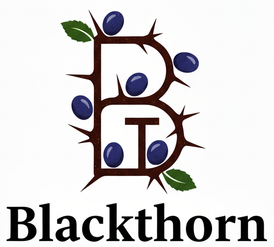

# 🌳 BlackThorn - C++ behavior tree Library



> ⚠️ The API is still evolving. Expect breaking changes while the library matures.

**BlackThorn** is a modern C++17 behavior tree library designed for robotics, simulation, and games, featuring its integrated editor and real-time visualizer, **Oakular**.

A behavior tree (BT) is a mathematical model — specifically, a directed acyclic graph — for expressing decision logic in plan execution, serving as an alternative to state machines. Behavior trees describe the switching between a finite set of tasks in a modular fashion. While a BT can be represented as a state machine, such representations can become unwieldy. The key strength of behavior trees lies in their ability to compose highly complex tasks from simple ones, without requiring knowledge of how those simple tasks are implemented.

This project builds upon [BrainTree](https://github.com/arvidsson/BrainTree) by adding missing features such as blackboards, file-based tree descriptions, and an editor. It also serves as a modernization of the [BehaviorTree.CPP](https://www.behaviortree.dev/) which has a complex code base. Key distinctions are BlackThorn uses unified YAML files for both tree structure and blackboard data (instead of BehaviorTree.CPP's two-part XML approach: one for the tree, one for the editor), provides subtree support (absent in BrainTree) and scoped blackboards (missing some features compared to BehaviorTree.CPP), and includes a fully open-source editor and real-time visualizer (proprietary in BehaviorTree.CPP).

BlackThorn is a wordplay on "BT" (behavior tree) and serves as the name of the behavior tree library itself (the "tree"—prunellier or épine noire in French). Oakular is a wordplay combining "Oak" and "Ocular."

## 💻 Quick Start

- Prerequisites:

```bash
sudo apt-get install libyaml-cpp-dev
```

- Download and compilation:

```bash
git clone https://github.com/Lecrapouille/BlackThorn --recurse

cd BlackThorn
make download-external-libs
make -j8          # builds library + editor + examples

./build/Oakular
./build/Example-GameState   # doc/examples/GameState
./build/Example-Patrol      # doc/examples/Patrol
```

See [Getting Started Guide](doc/getting-started.md) for installation and basic usage.

## Internal Documentation

- 📖 [Getting Started](doc/getting-started.md) - Installation and quick start
- 🌲 [Behavior Tree Primer](doc/bt-primer.md) - Core concepts, status, execution cycle, workflow
- 📚 [API Reference](doc/api-reference.md) - Complete API documentation
- 📝 [YAML Format](doc/yaml-format.md) - YAML file structure and syntax
- 🎯 [Node Types Guide](doc/nodes-guide.md) - All available node types
- 🧠 [Blackboard Guide](doc/blackboard-guide.md) - Blackboard usage and best practices
- 🖥️ [Visualizer Architecture & Guide](doc/visualizer-architecture.md) - Oakular visualizer architecture and usage
- 💡 [Examples Guide](doc/examples/examples-guide.md) - Complete examples walkthrough

## Additional Resources

- [Introduction to behavior trees](https://roboticseabass.com/2021/05/08/introduction-to-behavior-trees/) – roboticseabass.com
- [Behavior trees in Detail](https://lisyarus.github.io/blog/posts/behavior-trees.html) – lisyarus.github.io
- [BehaviorTree.CPP Documentation](https://www.behaviortree.dev/) – related library with similar concepts

## License

MIT License - see LICENSE file for details.
