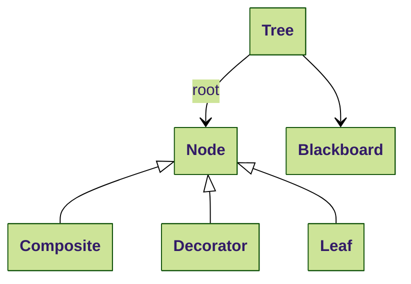
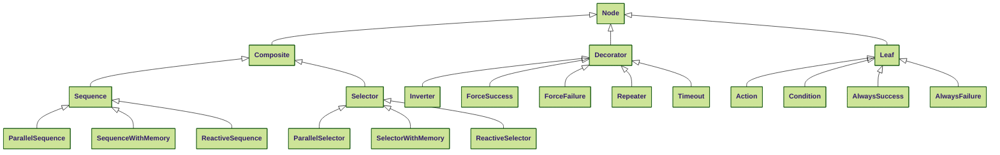
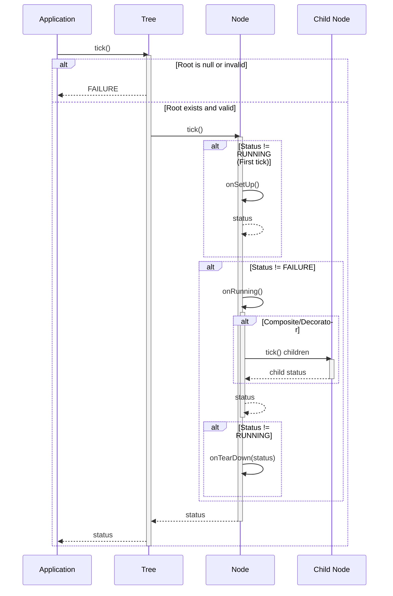

# 🌲 Behavior Tree Primer

A Behavior Tree (BT) is a directed acyclic graph used to express decision logic in robotics, games, and simulation.

---

## 📖 Core Concepts

- **Tree**: A hierarchical parent-children structure of nodes and a blackboard. The root is the initial node. A sub-tree is just an hierarchy view to make the tree smaller and more human readable.
- **Nodes**: The basic building blocks of a behavior tree. Nodes are of three types: composite, decorator, and leaf. Each nodes return `SUCCESS`, `FAILURE`, or `RUNNING`. Parents nodes, depending on their type, decide which children to invoke and how to interpret their status.
  - **Composite**: A node that has several children (at least one child).
  - **Decorator**: A node that has exactly one child and modifies its status (decoration).
  - **Leaf**: Nodes that don't have any children; these are the actual actions that interact with the system (i.e., robot commands).
- **Blackboard**: Since node instances do not know each other and may want to exchange data, they use a shared key/value structure (dictionary) for exchanging data. In the same way than C++ these values are the arguments of functions (here node): they can be either an `input` or and `output` or `input-output`.

---

## 🪾 Hierarchy of Nodes

The following diagram shows available nodes by this library. Each node will be fully described in [Node Types Guide](nodes-guide.md).

- Leaves:
  - Condition
  - Action
  - Always Success/failure
- Decorator:
  - Inverter
  - Force Success/failure
  - Repeater
  - Timeout
- Composite:
  - Sequence (with or without memory or reactive)
  - Selector (with or without memory or reactive)
  - Parallel Sequence

---

## 🚥​ Status

- 🟢​ **SUCCESS**: The task was completed successfully. In behavior tree visualizer, success nodes are painted in green.
- 🔴 **FAILURE**: The task could not be completed or a condition was not met. In behavior tree visualizer, failed nodes are painted in red.
- 🟡​ **RUNNING**: The task is still in progress and needs more time to complete. In behavior tree visualizer, running nodes are painted in yellow.

---

## ⌛ Execution Cycle

First, let remember the two important definitions:

- **Concurrency**: When two or more tasks can start, run, and complete in overlapping time periods. It doesn't necessarily mean they will ever both be running at the same instant.
- **Parallelism** is when tasks run at the same time in different threads, e.g., on a multi-core processor.

The execution way for running a tree is single-threaded with concurrency: nodes are executed in discrete time concurrently by their tick() callback. Tick is the fundamental execution mechanism in behavior trees:

- Each tick represents one update cycle of the behavior tree. Ticks occur at a frequency determined by the application (e.g., 10Hz for a robot, 60Hz for a game).
- A tick is a propagation of execution signals from parent to children. It flows down the tree from the root to the leaves following specific rules for each node type. When a parent node is ticked, it decides which children to tick based on its type.
- When a node is ticked, it executes its logic and returns a status: `SUCCESS`, `FAILURE`, or `RUNNING`. Since the logic is not executed inside a thread, the execution should return as soon as possible to avoid blocking the entire flow of execution of the tree.

---

## 💩 Workflow

The `tick()` function implements a template method pattern with hooks for `onSetUp()`, `onRunning()` and `onTearDown()`.

- A node calls `onSetUp()` on the first execution. This allows for initialization that can either succeed (SUCCESS) or fail (FAILURE).
- A node calls `onRunning()` on subsequent ticks, returning SUCCESS, FAILURE, or RUNNING.
- When a node transitions from RUNNING to SUCCESS/FAILURE, `onTearDown()` is called. This allows for cleanup operations.
- Different node types (Composite, Decorator, Leaf) implement different strategies for propagating ticks, as explained in details in [Node Types Guide](nodes-guide.md).

Here is the sequence diagram showing the execution flow:

---

## 📝 Simple Example

Let's consider a robot with the following minimal tree that allows it to cross a room.

The tree is composed of the following nodes:

- Root node depicted by the black dot.
- A single composite node named `Sequence` which is a composite node executing children in order until one fails. This node is given in all behavior tree libraries.
- For our example, three project-specific leaves depicting three actions the robot can perform:
  - opening a door,
  - walking through the doorway,
  - and closing the door.

Thanks to the `Sequence` node, the three actions `open the door`, `walk` and `close the door` are executed in this order and, in our case, immediately return the status `SUCCESS`. While three actions have not all ended with `SUCCESS` the status of the `Sequence` node stays to `RUNNING`. If one of the actions fails (return `FAILURE`), the status of the sequence node becomes `FAILURE` and stop executing children nodes. If all actions end with `SUCCESS`, the status of sequence node becomes `SUCCESS`.

In a real situation, each ticked actions of the robot will not immediately return `SUCCESS` or `FAILURE` but will last several seconds or minutes to be achieved. Each action shall not take too much time to not block the tree `tick()` to make reactive the robot by allowing the execution of other nodes. For this reason it will return `RUNNING`.

---

## 📚 More Documentation on Behavior Trees

You can read the following documents:

- [Introduction to Behavior Trees](https://roboticseabass.com/2021/05/08/introduction-to-behavior-trees/) – roboticseabass.com
- [Behavior Trees in Detail](https://lisyarus.github.io/blog/posts/behavior-trees.html) – lisyarus.github.io
- [BehaviorTree.CPP Documentation](https://www.behaviortree.dev/) – related library with similar concepts
