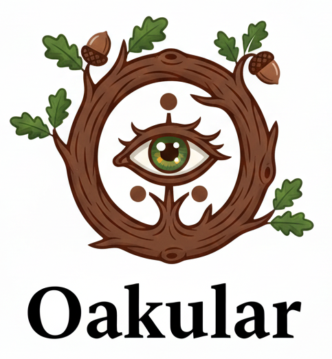
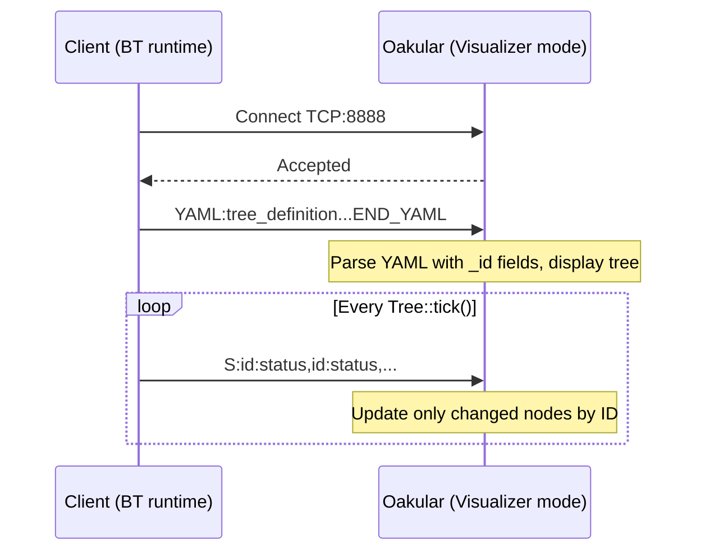

# 👁️ Visualizer Architecture & Guide

👁️ Oakular provides real-time visualization of running behavior trees. This document describes the visualization system architecture and explains how to use the visualizer.

## Overview

The system allows runtime monitoring of behavior trees through a client-server architecture:
- **Client**: The application running the behavior tree
- **Server**: Oakular (the editor) in visualizer mode

## Architecture Diagram



## Protocol

### Messages

All messages are text-based over TCP port 8888.

1. **Tree Structure** (sent once at connection):
   ```
   YAML:<yaml_content>
   END_YAML
   ```
   The YAML includes `_id` fields for each node:
   ```yaml
   BehaviorTree:
     Sequence:
       _id: 1
       name: Root
       children:
         - Action:
             _id: 2
             name: Task1
   ```

2. **State Updates** (sent after each tick, only changes):
   ```
   S:id:status,id:status,...\n
   ```
   - `id`: Node's unique `_id` from the YAML
   - `status`: 0=INVALID, 1=RUNNING, 2=SUCCESS, 3=FAILURE
   - Example: `S:2:1,5:2,7:3\n` means node 2→RUNNING, node 5→SUCCESS, node 7→FAILURE

### Node Identification

Each node has a unique `_id` that is:
- 🔢 Specified in YAML with `_id: N` field
- 🤖 Auto-generated by the Builder if not specified
- 📤 Always included when exporting with `Exporter::toYAML()`
- 💾 Persistent across save/load cycles

**Advantages over DFS indexing:**
- ✅ No need to synchronize traversal algorithms between client and server
- ✅ IDs are stable even if tree structure changes
- ✅ More robust and simpler to debug
- ✅ IDs can be saved/restored with the tree

## Usage

### 🚀 Starting Oakular in Visualizer Mode

```bash
./build/Oakular --port 9090
```

Then:

1. Go to Menu → Mode → Visualizer
2. The window will wait for client connections

### 🔌 Connecting from Your Application

```cpp
#include "BlackThorn/BlackThorn.hpp"
#include "BlackThorn/Network/VisualizerClient.hpp"

auto tree = bt::Tree::create();
// ... build your tree ...

auto visualizer = std::make_shared<bt::VisualizerClient>("127.0.0.1", 8888);
tree->setVisualizerClient(visualizer);

// ⏳ Wait for connection
while (!visualizer->isConnected()) {
    std::this_thread::sleep_for(std::chrono::milliseconds(100));
}

// ▶️ Run your tree - state changes will be sent automatically
while (running) {
    tree->tick();
    std::this_thread::sleep_for(std::chrono::milliseconds(100));
}
```

### 🎨 Visual Feedback

The visualizer displays nodes with colored borders:

- 🟢 **Green**: SUCCESS
- 🟡 **Orange/Yellow**: RUNNING
- 🔴 **Red**: FAILURE
- **Gray**: INVALID (not yet executed)

## Implementation Files

### Client (src/BlackThorn/)
- `VisualizerClient.hpp` - Client class declaration
- `VisualizerClient.cpp` - Client implementation
- `Core.hpp` / `BlackThorn.hpp` - Tree integration with `setVisualizerClient()`

### Server (src/Oakular/)
- `Server.hpp/cpp` - TCP server with YAML and status parsing
- `IDE.hpp/cpp` - Visualizer panel and state management
- `Renderer.hpp/cpp` - Node rendering and coloring based on runtime status
